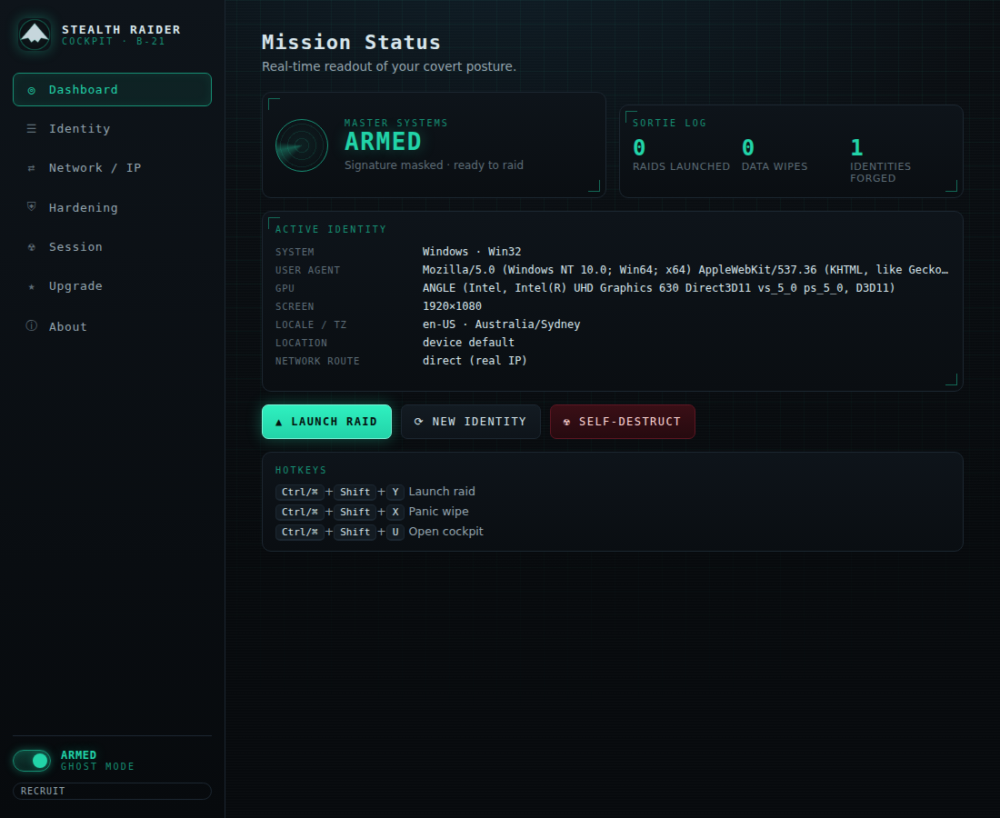

# Stealth Raider

> **Get in. Get out. Unnoticed.**
> A covert-ops privacy kit for Chrome. Named for the B‑21 Raider stealth bomber —
> built for missions where staying invisible is the whole point.

Stealth Raider masks the signals browsers and trackers use to identify you, runs
your sessions in disposable incognito windows, routes your IP through a proxy,
and self‑destructs every trace when the mission ends.



---

## Capabilities

| System | What it does |
| --- | --- |
| 🎭 **Fingerprint spoof** | Overrides `navigator`, `screen`, hardware, and Client Hints with a *coherent* fake identity (every value agrees with the others). |
| 🖌️ **Canvas / WebGL / Audio** | Injects tiny, per‑session **deterministic** noise so your canvas/WebGL/audio hash is stable within a session but unique across identities. |
| 🌍 **Location cloak** | Overrides the Geolocation API **and** timezone to a chosen city. |
| 🛰️ **IP cloaking** | Routes traffic through a SOCKS/HTTP proxy — your own (free) or a managed **Stealth Server** (Pro). |
| 🕵️ **Incognito raids** | Every "raid" launches in a fresh incognito window. |
| ☢️ **Self‑destruct** | Wipes cookies, cache, history, storage, service workers and more — automatically when a raid ends, or on demand. |
| 🛡️ **Hardening** | WebRTC leak protection, third‑party cookie blocking, DNT + Global Privacy Control, referrer stripping, hyperlink‑auditing & prefetch blocking. |
| 🚨 **Panic key** | `Ctrl/⌘+Shift+X` aborts the raid, scrubs everything, and forges a fresh identity. |

### Straight talk on what an extension can and can't do

- **IP:** a browser extension *cannot* invent a new IP by itself. Real cloaking
  routes traffic through a proxy/SOCKS endpoint. Stealth Raider configures that
  path — bring your own proxy (free) or subscribe to managed Stealth Servers
  (Pro). It never pretends there's a network hop that isn't there.
- **Fingerprint / location:** spoofed inside the page via API overrides. Very
  effective against common trackers; a determined adversary doing deep timing
  analysis may still find tells. This is privacy hardening, not a magic cloak.
- **Auto‑wipe:** raids run incognito (Chrome already discards that data on
  close). Auto‑wipe *additionally* scrubs any spill into your normal profile,
  **scoped to the raid's time window** so it never deletes your pre‑existing
  cookies or history. The manual **Self‑Destruct** button wipes everything.

---

## Install (developer / unpacked)

1. Generate the icons (only needed once, or after editing the generator):
   ```bash
   python3 tools/generate-icons.py
   ```
2. Open `chrome://extensions`, enable **Developer mode**.
3. **Load unpacked** → select this folder (the one containing `manifest.json`).
4. Open the extension's details and turn on **Allow in incognito** so raids and
   spoofing work inside incognito windows.
5. Click the toolbar icon to open the cockpit popup.

> Requires Chrome/Chromium **116+** (Manifest V3).

---

## Hotkeys

| Shortcut | Action |
| --- | --- |
| `Ctrl/⌘ + Shift + Y` | Launch a stealth raid (incognito) |
| `Ctrl/⌘ + Shift + X` | **Panic** — abort, wipe everything, new identity |
| `Ctrl/⌘ + Shift + U` | Open the cockpit |

---

## Architecture

```
manifest.json                 MV3 manifest (root = extension root)
src/
  background/service-worker.js Mission control: proxy, privacy, wipes, raids, identity, messaging
  content/
    inject-loader.js           ISOLATED world — couriers the identity into the page
    fingerprint-spoof.js        MAIN world — overrides navigator/canvas/WebGL/audio/geo/timezone
  lib/
    constants.js               Settings schema, message types, presets
    profiles.js                Coherent fingerprint identity generator (seeded PRNG)
    license.js                 Tiers + feature gating (single hasFeature() switch)
    storage.js                 Typed helpers over chrome.storage
  popup/                       Cockpit popup (arm switch, quick toggles, actions)
  options/                     Full cockpit (dashboard, identity, network, hardening, session, upgrade)
  ui/theme.css                 Shared stealth/cockpit theme
  assets/icons/                Generated PNG icons
tools/generate-icons.py        Pure‑Python icon generator (no dependencies)
```

**Data flow for spoofing:** the service worker generates a seeded identity and
stores it → `inject-loader.js` (ISOLATED, `document_start`) reads it and posts it
to `fingerprint-spoof.js` (MAIN world), which has already installed its API
overrides synchronously → overrides read the identity live, so a "New Identity"
takes effect on the next read without a reload.

---

## Monetization

Everything is gated through one function — `hasFeature(license, feature)` in
[`src/lib/license.js`](src/lib/license.js) — so turning any capability into a paid
one later is a one‑line table edit. Tiers ship wired end‑to‑end:

- **Recruit (Free)** — core stealth kit.
- **Raider Pro** — managed Stealth Servers, one‑click IP regions, location cloak,
  identity auto‑rotation, profile vault.
- **Squadron** — teams, shared server pools, policy sync.

License activation and the upgrade UI are already built. Before shipping paid
tiers, replace the dev‑only offline key decode in `activate()` with a
**server‑side verification** call (see the `TODO(monetization)` note). Never
trust a purely client‑side unlock in production.

See [`docs/MONETIZATION.md`](docs/MONETIZATION.md) for the go‑to‑market notes.

---

## Development

```bash
python3 tools/generate-icons.py   # (re)build icons
# then Load unpacked in chrome://extensions and hit "reload" after edits
```

No build step or bundler — it's plain ES modules and MV3. Lint with your editor;
syntax‑check with `node --check` / `node --input-type=module --check`.

---

## Companion Chrome theme

A matching **browser theme** lives in [`theme/`](theme/) — it dresses the whole
browser (frame, toolbar, tabs, omnibox, and a cockpit new-tab page) in the
Stealth Raider look. It's a separate package: `chrome://extensions` → **Load
unpacked** → select the `theme/` folder. See [`theme/README.md`](theme/README.md).

## Legal & responsible use

Stealth Raider is a **privacy** tool intended for lawful use: protecting your own
privacy, security research, and **authorized** testing. You are responsible for
complying with the terms of the sites you visit and with applicable law. Do not
use it to defraud, harass, or evade legitimate security controls.

## License

[MIT](LICENSE) © Stealth Raider.
