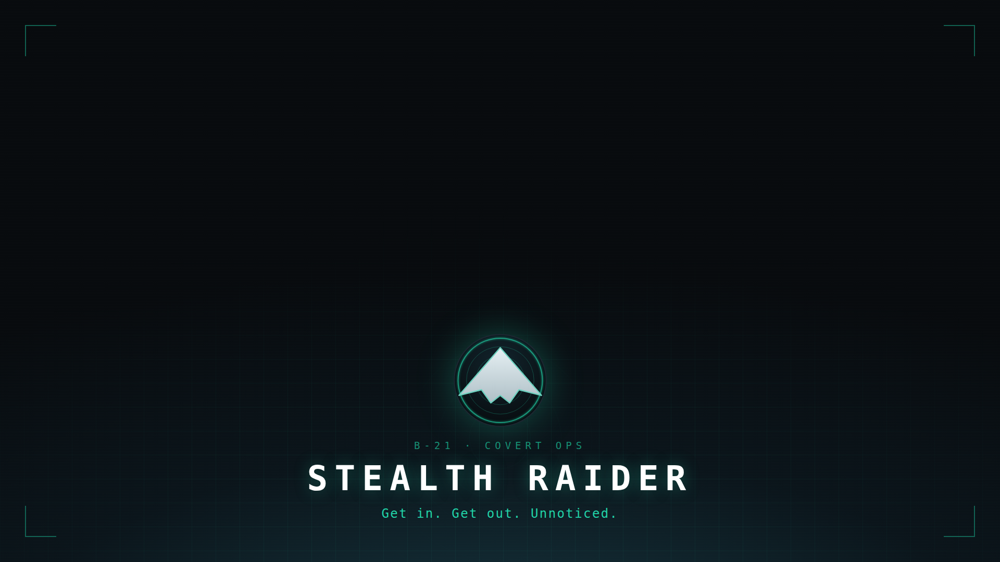

# Stealth Raider — Cockpit Theme

A Google Chrome **browser theme** that dresses your whole browser in the Stealth
Raider cockpit: matte-black stealth hull, phosphor-teal HUD accents, and a
new-tab page rendered from the same styling as the extension.



## What a theme can (and can't) do

A Chrome theme restyles the **browser chrome** — window frame, toolbar, tabs,
omnibox — and the **new-tab page background**. It is a separate package type from
the Stealth Raider extension and cannot render the extension's interactive UI
(popup/cockpit). This theme mirrors the extension's look; install it alongside
the extension for the full effect.

## Install (unpacked)

1. Open `chrome://extensions`, enable **Developer mode**.
2. **Load unpacked** → select this `theme/` folder.
3. The theme applies immediately. To remove it: `chrome://settings/appearance`
   → **Reset to default**.

> A theme and a regular extension can't live in the same package, so this ships
> in its own folder. Loading it does not replace or disable the extension.

## What's themed

- **Frame / toolbar / tabs / omnibox** — hull black `#070a0d`–`#0e141a`.
- **Accents & links** — phosphor teal `#22d3a8`.
- **New-tab page** — cockpit scene (HUD grid, radar rings, corner brackets, the
  flying-wing mark, wordmark and tagline). Branding sits in the lower third so
  it doesn't collide with Chrome's search box, and the scene fades to the flat
  NTP color at the edges so it looks seamless at any window size.

## Files

```
theme/
  manifest.json                    theme manifest (colors, tints, properties)
  images/
    theme_ntp_background.png       1920×1080 new-tab background
    icon128.png                    store / listing icon
```

## Regenerate the new-tab background

The background is rendered from HTML/SVG with the cockpit styling:

```bash
npm run theme        # -> node tools/generate-theme-bg.mjs
```

Requires Playwright (`npm i -D playwright && npx playwright install chromium`).
